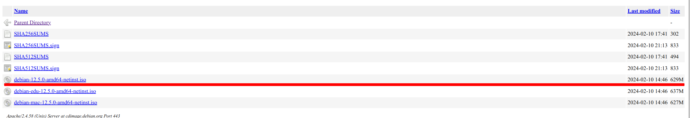

# Ansible Create OS

This repository contains the necessary tools to generate a custom Debian image using Ansible. It is designed to automate the process of creating an operating system image, allowing for consistent and reproducible builds.

<span style="color:red;">Attention! This project under development works only for Debian 12</span>
## Features

- Automated Debian image generation with pre-configured settings.
- Preseed configuration for non-interactive installation.
- Customizable settings for hostname, network configuration, and more.
- Integration with GitHub for version control and collaboration.

## Getting Started

To clone the project and start generating your Debian image, follow these steps:

1. Install Ansible on your system.
2. Clone this repository:
git clone https://github.com/dmytroiva/ansible_create_os.git
3. Navigate to the project directory:
cd ansible_create_os
4. Customize: 
- the preseed.cfg file according to your requirements. - download_debian_online.yml to change your home director.
-  change debian version if the play ***'Перевірка URL перед завантаженням Debian-iso'*** will not pass.
5. Run the Ansible playbook to generate the Debian image:
`ansible-playbook download_debian_online.yml -e ip_host=localhost"`
6. 

## Dependencies

- Ansible
- A Debian-based system or compatible environment for image generation
- Access to Debian package repositories or a local mirror

## Customization

Edit the preseed.cfg file to set up your network, user accounts, and package selections. You can specify your hostname, domain, and static IP configuration in this file.

## Example Usage

After configuring your preseed.cfg, generate the image with the following command:

```bash
ansible-playbook download_debian_online.yml -e "ip_host=localhost"
Введіть версію Debian (1 для 9, 2 для 10, 3 для 12): 3

PLAY [Створення та налаштування Debian VM] ****************************************************************************************************************************

TASK [Gathering Facts] ************************************************************************************************************************************************
ok: [localhost]

TASK [get the username running the deploy] ****************************************************************************************************************************
changed: [localhost]

TASK [Генерація URL для завантаження образу Debian] *******************************************************************************************************************
ok: [localhost]

TASK [Створення каталогу для зберігання ISO] **************************************************************************************************************************
ok: [localhost]

TASK [Перевірка URL перед завантаженням Debian-iso] *******************************************************************************************************************
ok: [localhost]

TASK [Завантаження образу Debian, якщо URL дійсний] *******************************************************************************************************************
ok: [localhost]

TASK [Встановлення необхідних утиліт] *********************************************************************************************************************************
ok: [localhost]

TASK [Розпакування завантаженого ISO образу Debian] *******************************************************************************************************************
changed: [localhost]

TASK [Зробити Automated Install Debian стандартним пунктом меню] ******************************************************************************************************
changed: [localhost]

TASK [Додати пункт Automated Install Debian в txt.cfg] ****************************************************************************************************************
changed: [localhost]

TASK [Змінити тайм-аут у всіх cfg файлах в каталозі isolinux] *********************************************************************************************************
changed: [localhost] => (item=txt.cfg)
changed: [localhost] => (item=menu.cfg)
changed: [localhost] => (item=adtxt.cfg)
changed: [localhost] => (item=adgtk.cfg)
changed: [localhost] => (item=rqtxt.cfg)
changed: [localhost] => (item=rqgtk.cfg)
changed: [localhost] => (item=isolinux.cfg)
changed: [localhost] => (item=prompt.cfg)

TASK [Очищення файлів конфігурації меню] ******************************************************************************************************************************
changed: [localhost] => (item=adspkgtk.cfg)
changed: [localhost] => (item=adtxt.cfg)
changed: [localhost] => (item=rqtxt.cfg)
changed: [localhost] => (item=rqspkgtk.cfg)
changed: [localhost] => (item=spkgtk.cfg)

TASK [Видалення пункту 'Install with speech synthesis' з grub.cfg] ****************************************************************************************************
changed: [localhost]

TASK [Генерація preseed файлу з шаблону] ******************************************************************************************************************************
changed: [localhost]

TASK [Створення образу з автовстановленням] ***************************************************************************************************************************
changed: [localhost]

TASK [Зміна власника для директорії "/home/dmytro/debian-auto-install-image-building"] ********************************************************************************
changed: [localhost]

TASK [Видалення тимчасової директорії] ********************************************************************************************************************************
changed: [localhost]

PLAY RECAP ************************************************************************************************************************************************************
localhost                  : ok=17   changed=11   unreachable=0    failed=0    skipped=0    rescued=0    ignored=0  
```

This will start the process of creating a Debian image based on the specifications you've provided.

### Якщо при перевірці згенерованного url виникла помилка 404
<details>
  <summary>Якщо на етапі перевірки згенерованного посилання, виникає помилка, то це означає, що компанія Debian оновила версію образу
Debian:</summary>

```bash
TASK [Перевірка URL перед завантаженням Debian-iso] *****************************************************************************************************************************************************************************
fatal: [localhost]: FAILED! => {"changed": false, "connection": "close", "content_type": "text/html; charset=iso-8859-1", "date": "Tue, 05 Mar 2024 09:26:53 GMT", "elapsed": 0, "msg": "Status code was 404 and not [200]: HTTP Error 404: Not Found", "redirected": false, "server": "Apache/2.4.58 (Unix)", "status": 404, "url": "https://cdimage.debian.org/debian-cd/current/amd64/iso-cd/debian-12.4.0-amd64-netinst.iso"}
...ignoring
```

Потрібно змінити значення змінної у `downolad_debian_online.yml` на актуальне.
Наприклад, у минулому місяці була версія 12.4.0, а зараз 12.5.0. Змінюємо значення 12.**4**.0 на 12.**5**.0:

`version_12: "debian-12.5.0-amd64-netinst.iso"`

Як зрозуміти, на яку версію змінювати. Відкриваємо згенероване посилання
https://cdimage.debian.org/debian-cd/current/amd64/iso-cd/debian-12.4.0-amd64-netinst.iso
і видаляємо версію `debian-12.4.0-amd64-netinst.iso`і переходимо у браузері на це посилання
https://cdimage.debian.org/debian-cd/current/amd64/iso-cd/. 

У ньому бачимо, що версія стала **12.5.0**


Після того як змінили, запускаємо плейбук ще раз
</details>


Contribution
Feel free to fork the project, make your changes, and submit a pull request. We appreciate your contributions to improve the project!

License
This project is open source and available under the MIT License.

All rights reserved by Dmytro Ivanov.
